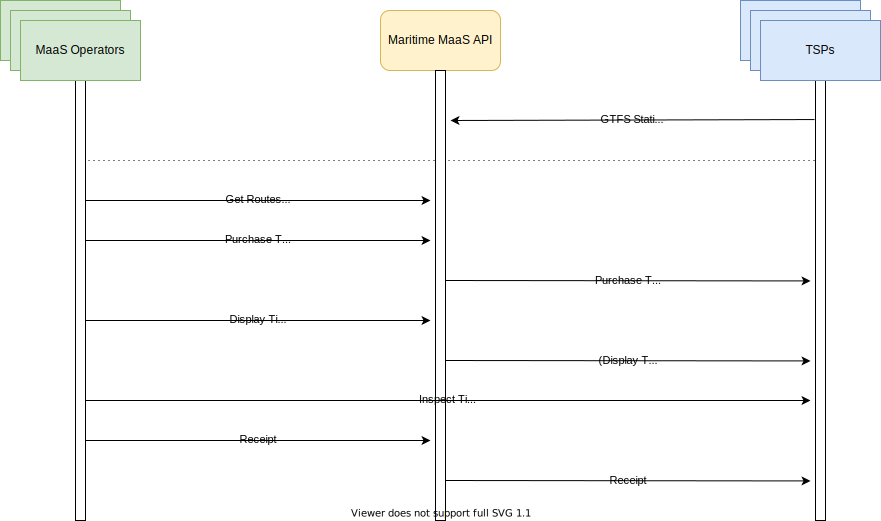

# Architecture

## General Architecture

### Overview

Maritime MaaS API is divided in to two different direction facing APIs:
1. The actual **MaaS API** which is offering REST endpoints for MaaS operators to get ticket options (routes, schedules, ticket types, etc.), purchase the ticket and perform other actions on the ticket.
2. The **Transport Service Provider API** or **TSP API** is handling the communications between MaaS API and the transport service providers or in other words the ticketing systems. Route, schedule and ticket type information is provided by TSPs via a [GTFS](https://gtfs.org/reference/static/) Feed which is read by the API. Ticket API is a set of REST endpoints implemented in the TSP which are requested by the API as a result of corresponding request by the MaaS Operator.

### Overall signalling flow

### Ticket Purchase Flow

### Ticket Display/Inspection Flow

## MaaS API

## Overview (Draft 10.3.2021)

MaaS API will consist of a set of REST endpoints which are used by MaaS client to accomplish following tasks:

-   Get routes
-   Get schedules
-   Get departures (capacity sales)
-   Get ticket types
-   Purchase ticket
-   Display ticket
-   Get ticket receipt

_TODO_

### Ticket Payload Data Model (Draft 10.3.2021)

This is a draft of the ticket payload contents that is used in the response of the **ticket purchase** and **ticket display** endpoints of the MaaS API to deliver the all the necessary ticket data to the **MaaS Operator** or in other words the client. **Bolded** fields are the new additions to the model.

| Field Name       | Field Type      | Example Value                                                               | Description                                                                                                                |     |
| ---------------- | --------------- | --------------------------------------------------------------------------- | -------------------------------------------------------------------------------------------------------------------------- | --- |
| `id`             | UUID            | be78e1f9-e4a4-48d2-b9fe-50aa335e5371                                        | Unifying identifier for a single ticket                                                                                    |     |
| `agencyId`       | number          | 1                                                                           | An id referencing to an agency/a ferry operator/TSP                                                                        |     |
| `ticketOptionId` | number          | 1                                                                           | Reference to ticket options which consists of customer type, ticket type and departure (in case of capacity sales enabled) |     |
| `validFrom`      | string (date)   | 2020-06-25T12:00:00.000Z                                                    | Ticket validity start date & time                                                                                          |     |
| `validTo`        | string (date)   | 2020-06-26T00:00:00.000Z                                                    | Ticket validity end date & time                                                                                            |     |
| `ticket`         | string          | 
...ticket...
                                                     | Ticket in HTML format                                                                                                      |     |
| `customerTypeId` | string (enum)   | adult                                                                       | Agency specific customer type id eg. "adult", "senior", "student"                                                          |     |
| `ticketTypeId`   | string (enum)   | single                                                                      | Agency specific ticket type id eg. single, return, day-ticket                                                              |     |
| `amount`         | string (number) | 12.00                                                                       | Price amount defined by ticketOptionId                                                                                     |     |
| `currency`       | string          | EUR                                                                         | Price currency                                                                                                             |     |
| `ticketName`     | string          | Island Hopping                                                              | Ticket name                                                                                                                |     |
| `description`    | string          | Hop-on hop-off -style ticket at the islands Matinkylä, Porvoo, and Iisalmi. | Ticket description                                                                                                         |     |
| `logoData`       | string (image)  | PHN2ZyB3aWR0aD0iNzExL...                                                    | base64 encoded image of the logo                                                                                           |     |
| `qrCode`         | string (image)  | data:image/png;base64,iVBORw0KGg...                                         | base64 encoded image of the qr code                                                                                        |     |
| `instructions`   | string          | Show ticket to inspector when boarding the ferry.                           | Special instructions for using the ticket                                                                                  |     |
| **`termsOfUse`** | string          | <http://www.terms.and.conditions.fi>                                        | Link to Terms of use declaration page on providers web site                                                                |     |
| **`refreshAt`**  | string (date)   | 2020-06-25T13:00:00.000Z                                                    | For the use of HSL-style animated tickets to be inspected manually                                                         |     |
| **`locale`**     | string          | fi                                                                          | The locale that ha been used to render the ticket and fetch description,instructions etc. eg. "fi", "sv", "en"             |     |

## TSP API (Transport Service Provider API)

### Overview

TSP API defines the communications between the MaaS API and TSP (Transport Service Provider aka ticketing system). The API is broken down into two parts:

1.  The General Transit Feed Specification (GTFS) which is served by TSP. It contains all static and semi-static information about the routes, schedules, fares and additional metadata. Standard way of describing transit data makes this API prepared for the future and Transport Service Providers are ready for serving their schedule information to other systems as well.
2.  Ticket API which is used to purchase a ticket, refresh ticket details or get a receipt of a ticket.

Currently GTFS static doesn't support the case with different prices for different customer types (or rider categories). Some options for covering this are the following extensions:

-   **GTFS Fares V2 proposal** (<http://bit.ly/gtfs-fares>) has some useful extensions including rider-categories. However the integration of that information to a fare/route price is still a bit unclear to me. This proposal has been given green light (February 2021) to be used in development and it’s unlikely to have any dramatic changes (according to the working group).

-   **GTFS+** (<https://www.transitwiki.org/TransitWiki/index.php/File:GTFS%2B_Additional_Files_Format_Ver_1.7.pdf>) is an extension used in San Francisco Bay Area and it introduces much simpler way to define rider categories (especially mapping them into fares). However it has it’s limitations for example currency is fixed to USD but with a few tweaks it could be usable.

### Specification

TSP API GTFS follows the GTFS static (January 17, 2019 revision, <https://gtfs.org/reference/static/>).

#### Reference

[TSP API Specification (WIP)](TSP-API.md)

#### TBD

-   How to include the information about rider category (Adult, Child, Senior...) in a way that it can be used in conjunction with datasets of existing GTFS standard (fare rules and attributes).
